# PatchBoot
This repository provides a guide for patching [AMI Aptio V UEFI firmware](https://www.ami.com/bios-uefi-utilities/) to circumvent [Secure Boot](https://learn.microsoft.com/en-us/windows-hardware/design/device-experiences/oem-secure-boot) checks and allow loading of unsigned executables.

## Disclamer
Flashing modified firmware onto your motherboard carries the risk of damaging it. On certain motherboards, **this damage could be irreparable**. Please proceed with caution - you have been warned.

## Reasons for patching
I use a single computer for both gaming and development, and my daily drivers are Arch Linux (yes, I felt the need to mention it) and Windows 10 LTSC/Windows 11. The issue is that certain intrusive anti-cheat systems require Secure Boot to be enabled. Though dual-booting with Secure Boot on is technically possible, it's an incredibly tedious process (and I would need to use different bootloader). So, I decided to straight up patch the firmware. I've [previously attempted simpler solutions](https://github.com/SamuelTulach/SecureFakePkg), but these anti-cheat systems have already adapted to detect and block such methods, preventing me from playing.

## Guide
Before starting with the entire process, ensure there is a way to flash modded firmware onto your motherboard. I have [ASUS ROG Strix X570-E Gaming](https://rog.asus.com/motherboards/rog-strix/rog-strix-x570-e-gaming-model) which has [USB BIOS FlashBack](https://www.asus.com/us/support/FAQ/1038568/) functionality that conveniently does not validate provided files. Other motherboards should be able to use [AMI AFU](https://www.ami.com/bios-uefi-utilities/). You can always search the internet for motherboard name + modded BIOS to see if there are any guides on flashing it and what tools are needed.

### Getting the original firmware
While it's possible to directly dump the firmware from your motherboard, in most cases, you can simply use the update .CAP file provided by your motherboard manufacturer. In my case, I simply downloaded [the latest one here](https://rog.asus.com/motherboards/rog-strix/rog-strix-x570-e-gaming-model/helpdesk_bios/).

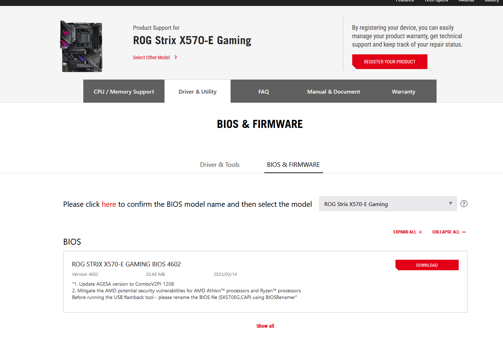

### Extracting EFI binaries
Once you have the firmware file, open it in [UefiTool](https://github.com/LongSoft/UEFITool) (make sure to use the latest stable version, as the nightly rewrite does not support module replacing).  

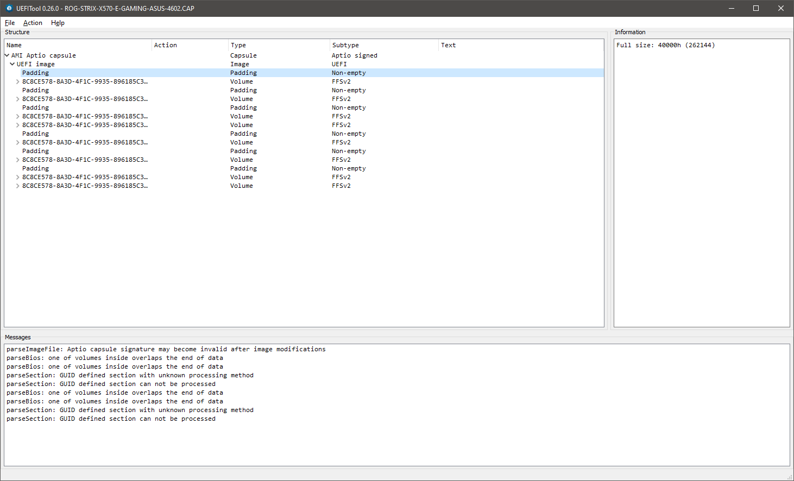

After loading the file, navigate to 'File > Search', and execute a case-insensitive text search for the string 'image verification'.

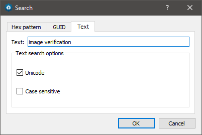

You should multiple results from SecurityStubDxe (GUID: `F80697E9-7FD6-4665-8646-88E33EF71DFC`).  You can navigate to the image by double-clicking on the entry `Unicode text "image verification" found in PE32 image section at offset XXXXh`. Then, right-click on the 'PE32 image section', and select 'Extract body...'.

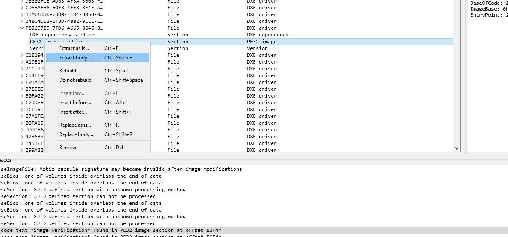

### Finding image verification handler
Now comes the most challenging part. To find the function responsible for image signature verification, you'll need to open the file in your preferred reverse engineering tool. In my case, that tool is [IDA Pro](https://hex-rays.com/ida-pro/). 


Once you've opened the file, search for the EFI_SECURITY_VIOLATION status code. This code corresponds to 0x800000000000001A in hex format. In IDA Pro, you can execute this search by navigating to 'Search > Immediate value...'. Check 'Find all occurences'.

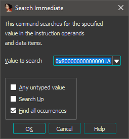

You'll get a list of a few hits. Examine these functions one by one. All of them will be short, except for one. This longer function will also feature a policy check at the top and that will be the handler function.

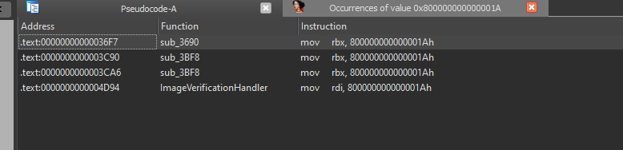

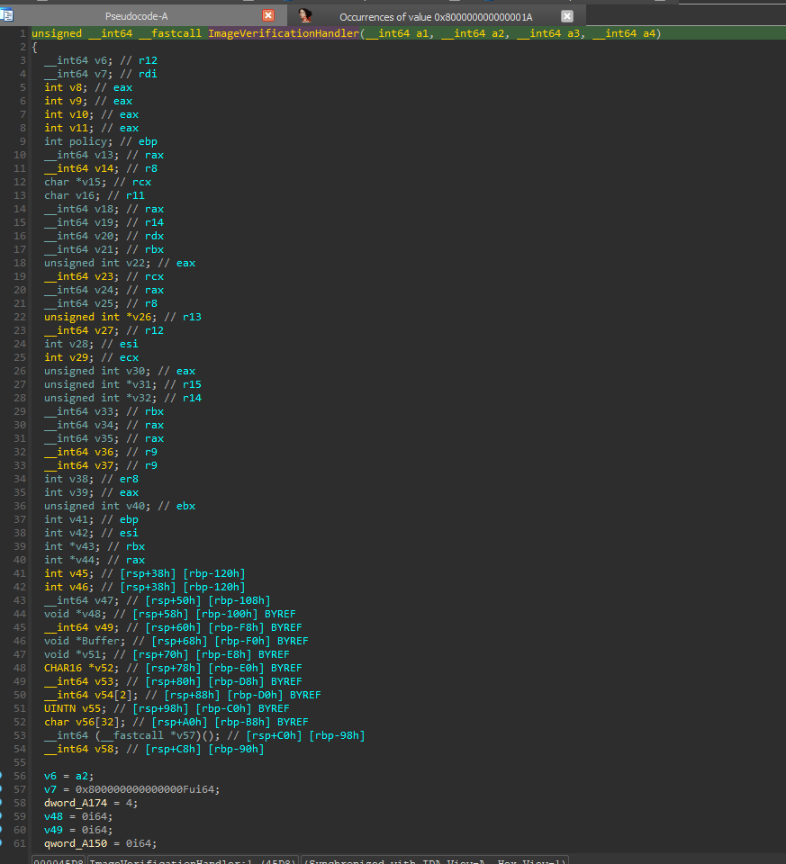

You can identify this as the handler because it checks the Secure Boot policy status as defined by the UEFI specification. If this policy is disabled, the handler simply returns EFI_SUCCESS.

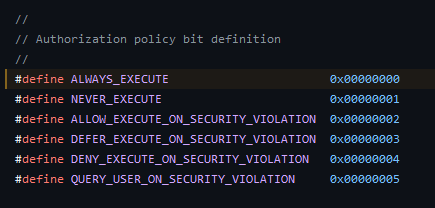

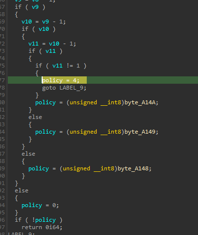

Now, you just need to copy the function bytes from the hex view for future use.

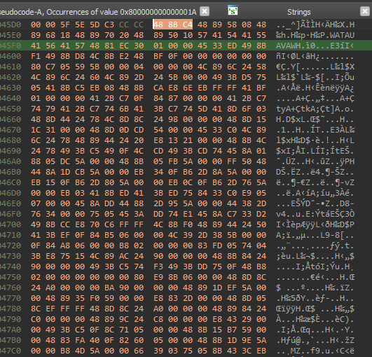

## Patching
Patching itself is incredibly easy. All we have to do is ensure the EFI_SUCCESS (zero) status is always returned. The [Microsoft ABI](https://learn.microsoft.com/en-us/cpp/build/x64-calling-convention?view=msvc-170), which is used here, returns the value from the function in the rax register.

"For instance, the assembly code that zeroes out the rax register and then returns could be as follows:
```
xor rax, rax
ret
```

Compiled it would then be `48 31 c0 c3`.

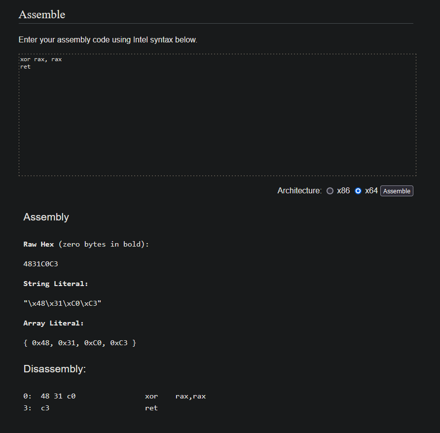

## Detection vectors